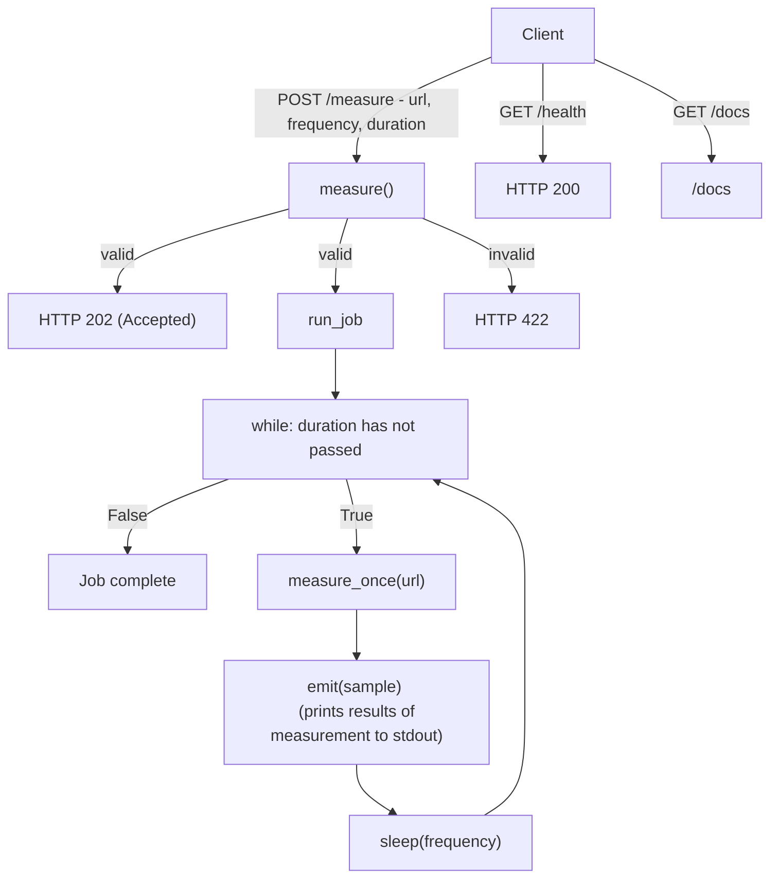

# A diagram describing the flow of the program

```mermaid
flowchart TD
    A[Client] 
    A -->|POST /measure - url, frequency, duration | B
    B["measure()"]
        B --> | valid | E & G
            E["HTTP 202 (Accepted)"]
            G["run_job"] --> H
            H[while: duration has not passed] --> | False | L["Job complete"]
            H --> | True | I
            I["measure_once(url)"] --> J
                J["emit(sample) \n (prints results of measurement to stdout)"] --> K
                    K["sleep(frequency)"] --> H

        B --> | invalid | F["HTTP 422"]

    A -->|GET /health | C
        C["HTTP 200"]

    A --> | GET /docs | D["/docs"]
```