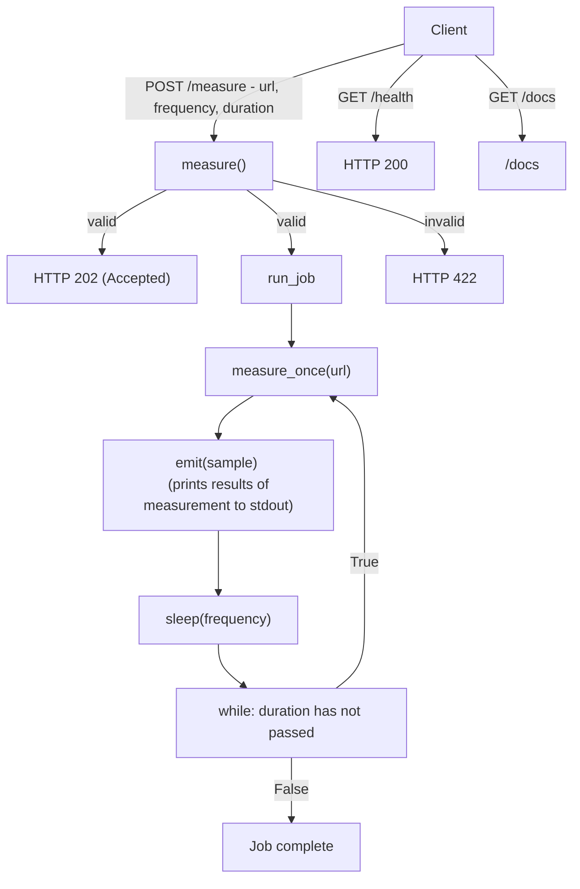

```mermaid
flowchart TD
    A[Client] 
    A -->|POST /measure - url, frequency, duration | B
    B["measure()"]
        B --> | valid | E & G
            E["HTTP 202 (Accepted)"]
            G["run_job"] --> H
            H["measure_once(url)"] --> I
                I["emit(sample) \n (prints results of measurement to stdout)"] --> J
                    J["sleep(frequency)"] --> K
                        K[while: duration has not passed]
                        K --> | True | H
                        K --> | False | L
                            L["Job complete"]

        B --> | invalid | F["HTTP 422"]

    A -->|GET /health | C
        C["HTTP 200"]

    A --> | GET /docs | D["/docs"]
```